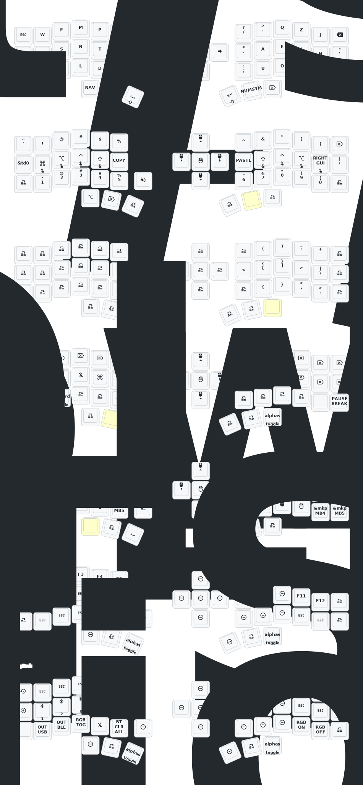

- [Chinese](README.md)
- [English](README_EN.md)

# 睫毛外设 (Eyelash Peripherals) Corne ZMK Repository

**This keyboard is not the same as [foostan's Corne](https://github.com/foostan/crkbd). It will not work with standard `corne` firmware.**

If you need a 3D model of this keyboard, email `380465425@qq.com`.

## Instructions

1. [Fork this repository](https://docs.github.com/en/get-started/quickstart/fork-a-repo#forking-a-repository).
2. [Click the **Actions** tab and make sure the workflow is enabled](https://docs.github.com/en/actions/managing-workflow-runs-and-deployments/managing-workflow-runs/disabling-and-enabling-a-workflow#enabling-a-workflow).
3. Make sure the `eyelash_corne` project in [`config/west.yml`](config/west.yml) still works. The `boards/arm/eyelash_corne` folder will be downloaded from this URL.
4. If there is still a `boards/arm/eyelash_corne` folder in your fork, delete it.

**If you already have a ZMK config repository, [you can add this one as a module instead of forking](https://zmk.dev/docs/features/modules#building-with-modules).**

## Keymap Diagram

---
---

- [中文](README.md)
- [English](README_EN.md)

# 睫毛外设 (Eyelash Peripherals) Corne ZMK 仓库

**该键盘与 [foostan's Corne](https://github.com/foostan/crkbd) 不同，无法与标准的 `corne` 固件兼容。**

如果您需要该键盘的 3D 模型，请发送电子邮件至 `380465425@qq.com`。

## 使用说明

1. [叉取此仓库](https://docs.github.com/en/get-started/quickstart/fork-a-repo#forking-a-repository)。
2. [点击 **Actions** 选项卡，确保工作流已启用](https://docs.github.com/en/actions/managing-workflow-runs-and-deployments/managing-workflow-runs/disabling-and-enabling-a-workflow#enabling-a-workflow)。
3. 确保 [`config/west.yml`](config/west.yml) 中的 `eyelash_corne` 项目仍然有效。`boards/arm/eyelash_corne` 文件夹将从此 URL 下载。
4. 如果您的叉取中仍存在 `boards/arm/eyelash_corne` 文件夹，请将其删除。

**如果您已经有 ZMK 配置仓库，[您可以将此作为模块添加，而不是叉取](https://zmk.dev/docs/features/modules#building-with-modules)。**

## Corne 键位图

